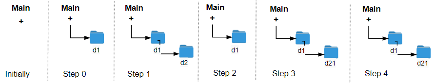

# PROBLEM STATEMENT

The Leetcode file system keeps a log each time some user performs a change folder operation.

The operations are described below:

 - "../" : Move to the parent folder of the current folder. (If you are already in the main folder, remain in the same folder).
 - "./" : Remain in the same folder.
 - "x/" : Move to the child folder named x (This folder is guaranteed to always exist).

You are given a list of strings logs where logs[i] is the operation performed by the user at the ith step.

The file system starts in the main folder, then the operations in logs are performed.

Return the minimum number of operations needed to go back to the main folder after the change folder operations.

# EXAMPLE

    Input: logs = ["d1/","d2/","../","d21/","./"]
    Output: 2

Explanation: Use this change folder operation "../" 2 times and go back to the main folder.

# **#1 USING A STACK - EXTRA MEMORY**

When we encounter something other than "./" or "../" then it means we will move to that child folder. So, in that case, we will push that folder to the stack.

When we encounter "../", then we want to pop from the stack because we want to move to the parent folder of current folder which means, the folder before it in the stack.

And when we are done doing this, either our stack will already be empty, or it will have some folders in it. If it is already empty, then since length of stack is 0, it means we had to do 0 operations to go back to "main" folder.

But if it is not empty, then it means, to reach the "main" folder, we have to remove all the folders from stack. That is, we have to use the "../" operation same number of times as number of elements in the stack.

And that's why, we will simply return the length of stack.

# **#2 USING CONSTANT MEMORY**

If all that we are tracking is how many elements we pushed to stack, why do we even need a stack in first place? We can use a simple counter that increments when we have to move to a new folder. And decrements when we have to go back to parent folder (if we are not already at the main folder)

And in this way, the value of this counter at the end will be the minimum operations that we need to go back to main folder.

In Stack approach, if stack was empty, we knew we were already at the main folder.
Here, if the counter is 0, then we know we are already at the main folder.
