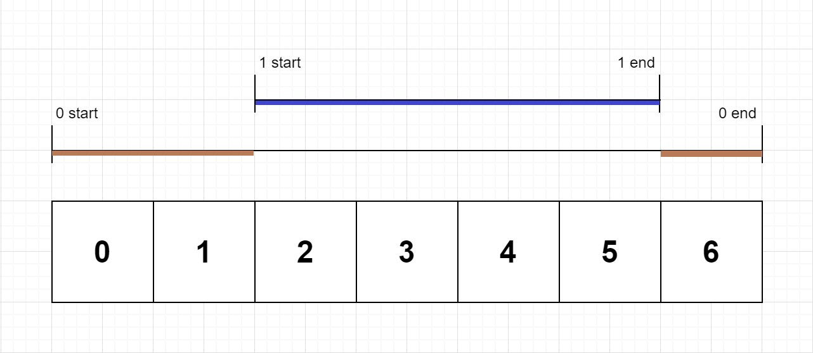

# PROBLEM STATEMENT

On a single-threaded CPU, we execute a program containing n functions. Each function has a unique ID between 0 and n-1.

Function calls are stored in a call stack: when a function call starts, its ID is pushed onto the stack, and when a function call ends, its ID is popped off the stack. The function whose ID is at the top of the stack is the current function being executed. Each time a function starts or ends, we write a log with the ID, whether it started or ended, and the timestamp.

You are given a list logs, where logs[i] represents the ith log message formatted as a string "{function_id}:{"start" | "end"}:{timestamp}". For example, "0:start:3" means a function call with function ID 0 started at the beginning of timestamp 3, and "1:end:2" means a function call with function ID 1 ended at the end of timestamp 2. Note that a function can be called multiple times, possibly recursively.

A function's exclusive time is the sum of execution times for all function calls in the program. For example, if a function is called twice, one call executing for 2 time units and another call executing for 1 time unit, the exclusive time is 2 + 1 = 3.

Return the exclusive time of each function in an array, where the value at the ith index represents the exclusive time for the function with ID i.

# EXAMPLE

    Input: n = 2, logs = ["0:start:0","1:start:2","1:end:5","0:end:6"]
    Output: [3,4]

Explanation:
Function 0 starts at the beginning of time 0, then it executes 2 for units of time and reaches the end of time 1.
Function 1 starts at the beginning of time 2, executes for 4 units of time, and ends at the end of time 5.
Function 0 resumes execution at the beginning of time 6 and executes for 1 unit of time.
So function 0 spends 2 + 1 = 3 units of total time executing, and function 1 spends 4 units of total time executing.

# APPROACH

One thing that you can instantly figure out is that "stack" will be used in this problem. Because, the problem mentions "Call Stack", which is a way to keep track of function calls so that we can see which call is currently executing and so on. The list of "logs" is basically the call stack from beginning to the end. And all we have to do now is to analyze this call stack and find for how long each function executed.

Do note that it is a "single-threaded CPU" which means, at one time, only one function can execute. This means, if we had some function that started at a time "x", but at some time "x + n", another function started, then the previous function has to pause its execution. It can only resume once the current function finishes excecuting.

And so, we now have to simulate this execution of functions in our code and make use of a stack to quickly figure out the execution times.

# **EXAMPLE**

Let's take an example to understand what the code below is doing - 

	n = 2, logs = ["0:start:0","1:start:2","1:end:5","0:end:6"]
	
	Output list initially = [0,0]
	
	Initially, stack is empty = []
	
	---------------------------------------------------------------------------------------
	
	We start with first log. Here, function_id = 0, and it "starts" at timestamp = 0
	
	Before pushing it to stack, we have to see whether there is any function already in progress.
	
	In that case, we have to pause that function and note its time of execution till this point.
	
	So that when that function finishes executing, we can easily calculate the overall time of execution.
	
	Here, we have no function running at this point so we simply push a pair in stack -> [function_id, start time]
	
	stack = [[0,0]]
	
	---------------------------------------------------------------------------------------
	
	Next, we have the second log -> "1:start:2"
	
	Here, we see that a new function with id = 1 starts its execution.
	
	But our function with id 0 has not yet ended.
	
	This means, function with id 0 will pause here and so it means,
	function with id = 0  executed for -> (2 - 0) => 2 units of time and then paused.
	
	So, we will update its execution time so far in output list.
	
	Output = [2,0]
	
	And then we push the current function call to the stack.
	
	stack = [[0,0], [1,2]]
	
	---------------------------------------------------------------------------------------
	
	The third log is -> "1:end:5"
	
	It means, the function with id = 1 finished executing at timestamp = 5.
	
	So, it means, we can pop this from the call stack as it is done executing.
	
	And hence, its total time of exection is -> (5 - 2 + 1) => 4
	
	Output = [2,4]
	
	Also, since after popping, stack is ->  [[0,0]]
	
	It means, the function with function id = 0 might resume its execution now.
	
	Why I said "might"? 
	
	Because, it is possible that the next function that starts executing is some other function and not the one with id = 0.
	
	So, we will update the starting time of function with id = 0 in the stack to -> (The time at which current function ended + 1)
	
	Because if you think, it makes sense that when the current function ends, 
	only after that the previous function can resume exection if it wants to. 
	
	Since the function with id = 1 ended at time = 5, it means,
	if the function with id = 0 wants to resume executing, it should start at timestamp = 6
	
	Stack = [[0,6]]
	
	---------------------------------------------------------------------------------------
	
	Finally, we have the log "0:end:6"
	
	It means, the function with id = 0 finally ended executing.
	
	And so, it executed for -> (6 - 6 + 1) => 1 unit of time.
	
	Right now, output list is ->  [2,4]
	
	It means, the function with id = 0 has already executed for 2 units of time before.
	And now, it executed further 1 unit of time before finishing its execution.
	
	So in total, the execution time is 2 + 1 => 3
	
	So just make sure that when you are calculating the execution time, you use "+=" and not just "+".
	
	Beacuse it is possible that the current function executed for some units of time before being interruped by some new function call.
	
	Output list = [3,4] => FINAL RESULT.