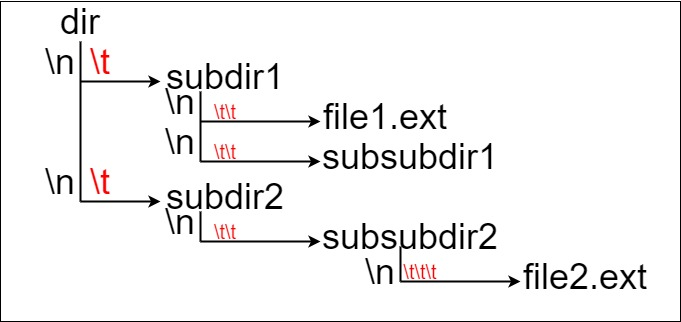
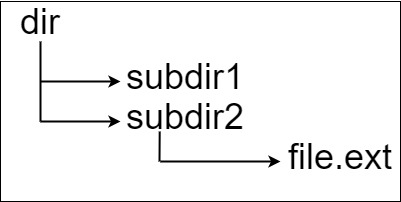

# PROBLEM STATMENT

Suppose we have a file system that stores both files and directories. An example of one system is represented in the following picture:

Here, we have dir as the only directory in the root. dir contains two subdirectories, subdir1 and subdir2. subdir1 contains a file file1.ext and subdirectory subsubdir1. subdir2 contains a subdirectory subsubdir2, which contains a file file2.ext.

In text form, it looks like this (with ⟶ representing the tab character):

    dir
    ⟶ subdir1
    ⟶ ⟶ file1.ext
    ⟶ ⟶ subsubdir1
    ⟶ subdir2
    ⟶ ⟶ subsubdir2
    ⟶ ⟶ ⟶ file2.ext

If we were to write this representation in code, it will look like this: "dir\n\tsubdir1\n\t\tfile1.ext\n\t\tsubsubdir1\n\tsubdir2\n\t\tsubsubdir2\n\t\t\tfile2.ext". Note that the '\n' and '\t' are the new-line and tab characters.

Every file and directory has a unique absolute path in the file system, which is the order of directories that must be opened to reach the file/directory itself, all concatenated by '/'s. Using the above example, the absolute path to file2.ext is "dir/subdir2/subsubdir2/file2.ext". Each directory name consists of letters, digits, and/or spaces. Each file name is of the form name.extension, where name and extension consist of letters, digits, and/or spaces.

Given a string input representing the file system in the explained format, return the length of the longest absolute path to a file in the abstracted file system. If there is no file in the system, return 0.

Note that the testcases are generated such that the file system is valid and no file or directory name has length 0.

#  EXAMPLE

    Input: input = "dir\n\tsubdir1\n\tsubdir2\n\t\tfile.ext"
    Output: 20

Explanation: We have only one file, and the absolute path is "dir/subdir2/file.ext" of length 20.

# APPROACH

By looking at the example, you might've understood that we can know whether a current substring is a part of the current path or not by looking at the count of "\t" characters.

	For example, input = "dir\n\tsubdir1\n\tsubdir2\n\t\tfile.ext"
	
Just like how in examples, they have the images showing the paths, we will break this input string.
	
So, we will break our input string at the newline characters because they represent beginning of a new subpath.
	
	On doing that, our input will become -> input = ["dir", "\tsubdir1", "\tsubdir2", "\t\tfile.ext"]
	
Now, all that we need to take care of is the number of "\t" together in any substring.
	
If the count is one more than previous count, that means, the current substring is a part of the previous path only.
	
But if count is same or less than previous count, it means, it is not the part of previous path. 
	
Lets understand using the example.
	
So we get root directory as "dir" and at this point, since there are no "\t" characters in this substring, count is 0.
	
Next, we have  "\tsubdir1". Since here, there is "1" \t character, and it is 1 > 0, it means,  "\tsubdir1" is a directory inside "dir"
	
	So far, our path is -> dir/subdir1
	
Next, we have "\tsubdir2". Since here as well, we have count = 1, it means, "\tsubdir2" is a directory inside "dir"
	
What does this mean? It means, we are done with "subdir1" and no longer need it because we are already inside subdir2 now.
	
And since subdir1 did not have any file, we did not even consider the length of the path -> dir/subdir1

So once we remove the subdir1 from our path and put subdir2 now, 

	Our path becomes dir/subdir2

Finally, in the input, we have "\t\tfile.ext".

The count of \t is 2. Since 2 is greater than previous count (1), it means, "\t\tfile.ext" is a part of ongoing path only. 

In simpler words, "file.ext" is a file present inside subdir2 directory which is in turn present insidr dir.

And since "file.ext" has a dot, it is a file. And this means, we got a valid path that ends in a file and so we can take its length and update the maxLength.

And our loop ends. 

	So, our final path becomes -> dir/subdir2/file.ext
	
As we have to keep track of what was the previous count and what was the length of previous substring, here, stack will be an appropriate data structure to use. 

Do note that once we are done with the loop, we also need to take care of the number of slash ("/" that we have to put in the path (if there exists a valid path). That will simply be (length of the stack - 1). Why -1? Because we do not want to add a slash after the last file in the path.