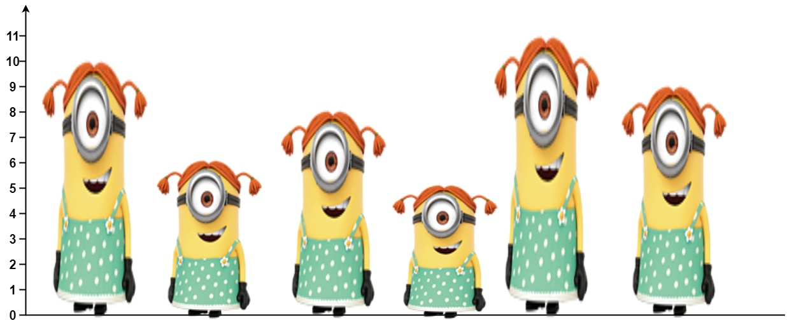

# PROBLEM STATMENT

There are n people standing in a queue, and they numbered from 0 to n - 1 in left to right order. You are given an array heights of distinct integers where heights[i] represents the height of the ith person.

A person can see another person to their right in the queue if everybody in between is shorter than both of them. More formally, the ith person can see the jth person if i < j and min(heights[i], heights[j]) > max(heights[i+1], heights[i+2], ..., heights[j-1]).

Return an array answer of length n where answer[i] is the number of people the ith person can see to their right in the queue.

# EXAMPLE

    Input: heights = [10,6,8,5,11,9]
    Output: [3,1,2,1,1,0]

    Explanation:

    Person 0 can see person 1, 2, and 4.
    Person 1 can see person 2.
    Person 2 can see person 3 and 4.
    Person 3 can see person 4.
    Person 4 can see person 5.
    Person 5 can see no one since nobody is to the right of them.

# **1. BRUTE FORCE APPROACH - O(N^2) - TLE**

The Brute Force approach is pretty straightforward.

Just do what the problem says. That is, for each person, look at the list on the right & count all those that can be seen.

Now, since for each person, we have to traverse the whole list on the right side, the complexity of this solution turns out to be approximately O(N^2). And so, we get TLE for large inputs.

But from this code, we can start to think of how to write an Optimized solution.

# **2. STACK APPROACH - O(N)**

If you are thinking how we came to know if "Stack" would be a suitable data structure to use here, then just remember one thing - 

If we have a scenario where, there is a nested loop and the inner loop depends on the outer loop's variable, then we can optimize that code using a Stack.

In the above solution, we see that the inner loop depends on the outer loops "i" variable. We need to know what the "i" is only then we can search on its right.

So, here we can use a Stack to optimize this problem.

And now, remember one more thing. When we use a Stack to optimize nested loops, just iterate in the opposite direction as compared to what we do in Brute Force approach.

In Brute Force approach above, the outer loop runs from left to right so when we use a Stack, we will go from right to left.

Let's take an example.

	heights = [10,6,8,5,11,9]
	
	Stack = []
	
	# Let's initialize it with 0 for all
	Output = [0, 0, 0, 0, 0, 0]
	
	As we start from right to left, we come across the height "9". Obviously, there is no one on its right so for it, the output will be 0.
	
	But, we also push it to stack because it might be visible to some other person before it. 
	This is the important part. 
	We are not discarding the useful data. Something that we were doing in the Brute force approach.
	
	
	Stack = [9]
	
	Output = [0, 0, 0, 0, 0, 0]
	
	____________________________________________________________________________________________
	
	Next up, we have the height = 11. Now, in the stack, we have only one height which is "9". 
	
	And obviously, if a person is of height 11, he can see the person with height "9".
	
	But now, think about it. Does it make sense to keep "9" in this stack now that we have "11"?
	
	No matter what height the person before "11" has, he can never see "9" because of "11".
	
	So, that's why, "9" is now a useless value for us and we can discard it. 
	
	But again, do note that "11" can still see "9" so we need to count that.
	
	Hence, as we pop from stack, we also keep a counter.
	
	So, after popping, count = 1, and stack is empty.
	
	Since stack is empty, it means, there is no other person that "11" can see. So for 11, output is 1.
	We also push "11" to stack.
	
	Stack = [11]
	
	Output = [0, 0, 0, 0, 1, 0]
	
	____________________________________________________________________________________________
	
	Next, we have height = 5. In the stack, we have only "11". But do we remove it? NO!
	
	Why? Because suppose if there is person of height greater than "5" before it. Then that person can also see "11". 
	
	So, "11" is still a useful value to us.
	
	Hence, we won't remove anything from stack if the current height is smaller than top of stack.
	
	But, what about our counter? We increment counter only when we pop right?
	
	And here, we introduce one more line of code.
	
	See, when we pop from stack, it is not always possible that stack will be empty after the pops.
	
	Here, stack is not empty. What does that suggest? It suggests that the height at top of stack is bigger than "5".
	
	So obviously "5" can see that person on its right. 
	
	Hence, when, after popping, stack is still not empty,
	we will increment our count by 1 to also count that person on top of stack. 
	
	Hence, for "5", the count becomes 1. We push "5" to stack as well.
	
	Stack = [11, 5]
	
	Output = [0, 0, 0, 1, 1, 0]
	
	____________________________________________________________________________________________
	
	Next, we have height = 8.
	
	This time, we see that stack has "5" on top which is smaller than "8".
	
	So even though "8" can see it, no height before "8" will be able to see "5".
	
	So, we pop "5" and increment count by 1 for "8".
	
	Now, top of stack has "11". But that is not popped since 11 > 8.
	
	And using the same logic as above, since stack is not empty yet,
	it means person of height "8" can see person of height "11" as well.
	
	So count is incremented by 1.
	
	Hence, for "8", count is 2. We push "8" to stack as well.
	
	Stack = [11, 8]
	
	Output = [0, 0, 2, 1, 1, 0]
	
	____________________________________________________________________________________________
	
	Next, we have height = "6"
	
	Since top of stack is "8", nothing is popped.
	
	But since stack is not empty, it means, the person of height "6" can still see the person of height "8".
	
	So count becomes 1.
	
	Stack = [11, 8, 6]
	
	Output = [0, 1, 2, 1, 1, 0]
	
	
	____________________________________________________________________________________________
	
	Finally, we have height = "10".
	
	Since top of stack has "6", it is popped and count = 1
	Now, top of stack has "8", it is popped and count = 2
	Finally, top of stack has "11". It is not popped since 11 > 10.
	
	But since stack is not empty at this point, it means, person with height = "10" can still see person with height = "11"
	So, count becomes 3. 
	
	Stack = [11, 10]
	
	Output = [3, 1, 2, 1, 1, 0]

And that's how using a stack, we can write an O(N) Time solution.

