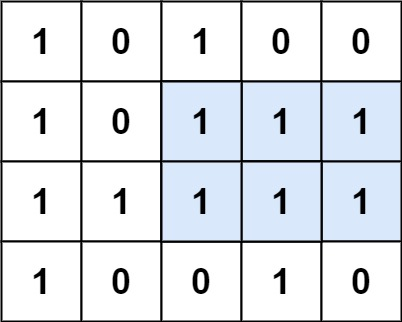

# PROBLEM STATEMENT

Given a rows x cols binary matrix filled with 0's and 1's, find the largest rectangle containing only 1's and return its area.

# EXAMPLE

Input: matrix = [["1","0","1","0","0"],["1","0","1","1","1"],["1","1","1","1","1"],["1","0","0","1","0"]]
Output: 6

Explanation: The maximal rectangle is shown in the above picture.

# APPROACH

In this problem, we have to find the maximum area rectangle in a matrix or a 2D array. 

What if we had a 1D array? 

In that case, we know how to find the maximum array because that's just the maximum area in a histogram problem - https://leetcode.com/problems/largest-rectangle-in-histogram/

So, does a 2D array make any difference? 

Suppose, we have matrix = [["1","0","1","0","0"],["1","0","1","1","1"],["1","1","1","1","1"],["1","0","0","1","0"]]

Now, take the first row of this matrix -> ["1","0","1","0","0"]

It is just a 1D array or a histogram and we can easily find the maximum area rectangle in this.

Maximum Area => 1 (height = 1, width = 1)

Now, what happens if we add another row? 

	["1","0","1","0","0"]
	["1","0","1","1","1"]
	
What does this mean? It means, we added a new floor below the previous floor. 

So after doing that, our new histogram is now [2,0,2,1,1]

That is, we combined the previous heights and current height.

Do note that if we have a "0" in the new floor, it means there can be no building on this index. In simpler words, "0" represents ground level.

So, isn't it easy to find the maximum area in [2,0,2,1,1] ? It is still a 1D array / histogram.

Maximum Area = 1 * 3 => 3 (height = 1, width = 3)

And similarly, let's add the third row as well.

	["1","0","1","0","0"]
	["1","0","1","1","1"]
	["1","1","1","1","1"]
	
Now, the new histogram will be => [3,1,3,2,2]

And Maximum area => 2 * 3 => 6 (height = 2, width = 3)

And finally, add the fourth row as well

	["1","0","1","0","0"]
	["1","0","1","1","1"]
	["1","1","1","1","1"]
	["1","0","0","1","0"]
	
Now, the new histogram is [4,0,0,3,0]

And maximum area in this is 4 * 1 -> 4 (height = 4, width = 1)

So, overall, maximum area is => 6 and that's the required answer for this matrix.

Hence, this problem can be divided into two steps -

Step 1 -> From the input matrix, get the separate histograms
Step 2-> For each histogram, calculate maximum area and finally, get the maximum out of all those maximum areas and return it