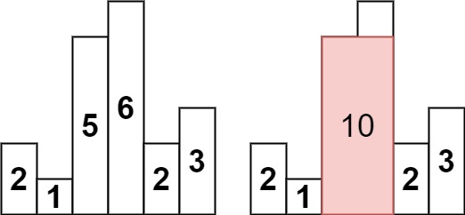

# PROBLEM STATEMENT

Given an array of integers heights representing the histogram's bar height where the width of each bar is 1, return the area of the largest rectangle in the histogram.

# EXAMPLE

    Input: heights = [2,1,5,6,2,3]
    Output: 10

Explanation: The above is a histogram where width of each bar is 1.
The largest rectangle is shown in the red area, which has an area = 10 units.

# APPROACH

Let's take the above example.

	heights = [2,1,5,6,2,3]
	
	If we take the bar of height "2" at index 4
	We can have a rectangle that goes all the way till the end to the right 
	and till the index "2" to the left
	
	Now, why we couldn't go past index "2" on left? 
	
	Because after index "2", we have a bar of smaller height than  "2".
	
	And this same logic can be applied to the right side. 
	
	If we take the first index and the first bar with height "2", then we cannot expand it further to right.
	Because just after it, we have a bar of height smaller than "2".
	
	
So, what can we conclude? We can conclude that if we take any "bar" and we want to find the width of rectangle that will include this "bar", then we just have to go till the nearst smaller element on left (not including it) and till the nearest smaller element on right (not including it).

	For heights = [2,1,5,6,2,3]
	 
	The nearest smaller on left list will be [-1,-1,1,2,1,4]
	
	Here, each value in this list is an "index".
	
	So for index = 0, we have -1 which means 
	there is no nearest smaller on its left and so, 
	a rectangle that includes the index "0" bar will include the whole left side of index 0.
	
	Same is the case for the index "1" since for it as well, we have "-1" in the NSL list. 
	
	Similarly, we can have the nearest smaller on right list as [1,6,4,4,6,6]
	
	Here, for index = "1", we have value = 6. Again, each value is an index. 
	And index "6" is not a valid index for the "heights" list. 
	But, it means, any rectangle that includes the bar at index "1",
	will expand till the end of this list on right side. 
	
And now that we have the NSL and NSR lists, we can easily calculate the rectangle that each "bar" will generate.
Because if we know the left and right boundaries of any bar, we can easily find the width of rectangle that is generated by that "bar".

	heights = [2,1,5,6,2,3]
	NSL =     [-1,-1,1,2,1,4]
	NSR =     [1,6,4,4,6,6]
	
	Let's take the index = 1 That is, the bar with height "1"
	
	NSL[1] is -1
	NSR[1] is 6
	
	So, how many bars are in between?
	
	There are NSR[1] - NSL[1] - 1 bars in between
	
	In other words, width of rectangle formed by index = 1 is NSR[1] - NSL[1] - 1 
	=> 6 - (-1) - 1 => 6 + 1 - 1 => 6
	
	And height is ofcourse "1" only.
	
	So area of this rectangle is 6 * 1 => 6
	
	But this may or may not be the maximum
	
	So, we will do this calculation for each "bar" and eventually, the maximum will be "10".

If you know the concepts of Nearest Smaller on Left & Nearest Smaller on Right and how to calculate these efficiently using stacks, then this problem will be a piece of cake. And if you understand this problem then you can easily solve this problem as well -> https://leetcode.com/problems/maximal-rectangle/

Here is my solution and explanation for this problem ->https://leetcode.com/problems/maximal-rectangle/discuss/3616930/Python-Similar-to-Maximum-Area-in-Histogram