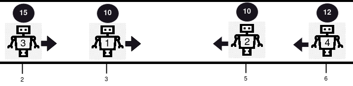

# PROBLEM STATEMENT

There are n 1-indexed robots, each having a position on a line, health, and movement direction.

You are given 0-indexed integer arrays positions, healths, and a string directions (directions[i] is either 'L' for left or 'R' for right). All integers in positions are unique.

All robots start moving on the line simultaneously at the same speed in their given directions. If two robots ever share the same position while moving, they will collide.

If two robots collide, the robot with lower health is removed from the line, and the health of the other robot decreases by one. The surviving robot continues in the same direction it was going. If both robots have the same health, they are both removed from the line.

Your task is to determine the health of the robots that survive the collisions, in the same order that the robots were given, i.e. final heath of robot 1 (if survived), final health of robot 2 (if survived), and so on. If there are no survivors, return an empty array.

Return an array containing the health of the remaining robots (in the order they were given in the input), after no further collisions can occur.

Note: The positions may be unsorted.

# EXAMPLE

Input: positions = [3,5,2,6], healths = [10,10,15,12], directions = "RLRL"
Output: [14]

Explanation: There are 2 collisions in this example. Firstly, robot 1 and robot 2 will collide, and since both have the same health, they will be removed from the line. Next, robot 3 and robot 4 will collide and since robot 4's health is smaller, it gets removed, and robot 3's health becomes 15 - 1 = 14. Only robot 3 remains, so we return [14].

# APPROACH

It is not hard to figure out that this is a Stack-based problem since we have to repeatedly check collisions of the current robot with previous robots. And we can do that efficiently using a Stack.

Now the thing is, the positions on which robots are placed on a line is not provided in a sorted order. It means, to correctly check the collisions, we have to first place the robots in right order. In other words, we have to sort the robots based on their positions in increasing order. And since we have three different lists, it is not a good idea to sort each separately as that will not give us the correct data.

We have to merge the three lists into one such that at each index, we have each robot's position, health, direction and also the original index.

Then, we can sort by position.

The reason why we have the original index in this merged list is because later when we have to return the output, we have to return the robots in the same order in which they initially were. In that case, we will again have to sort the list but that time, we will sort based on the original index values.